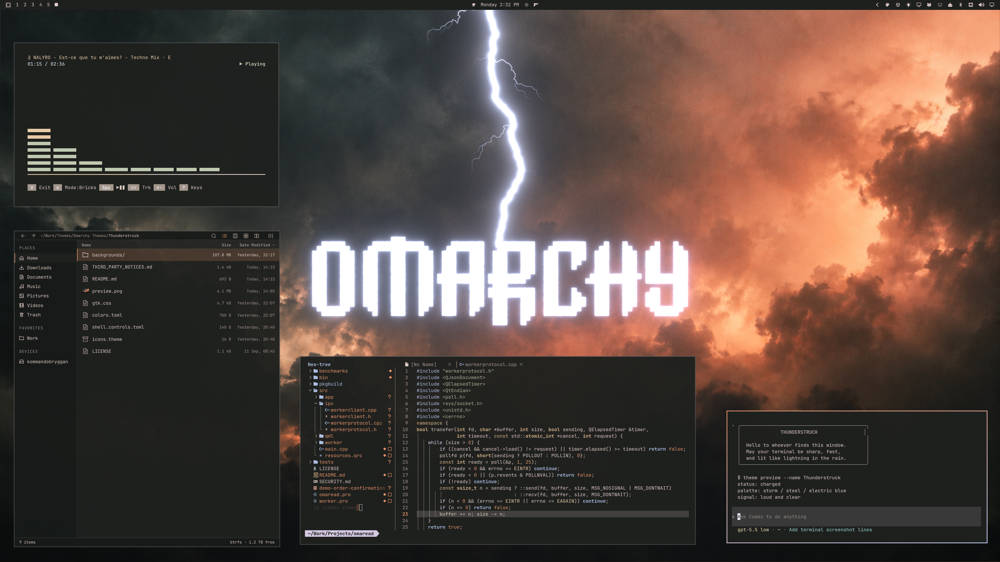

# Thunderstruck

An Omarchy dark theme with charcoal surfaces, copper-peach accents, and blue-white lightning.





## Install

For **Omarchy 4 with Omarchy Shell**:

```sh
omarchy theme install https://github.com/ejuro/omarchy-thunderstruck-theme.git
```

Select **Thunderstruck** in the theme picker. Use `omarchy theme bg next` to cycle through the three 4K wallpapers: wordmark, logo, and plain storm clouds.

## Credits

See [LICENSE](LICENSE) and [third-party notices](THIRD_PARTY_NOTICES.md).
